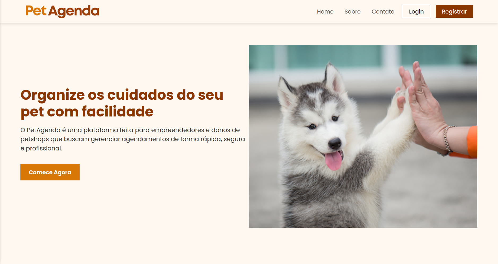
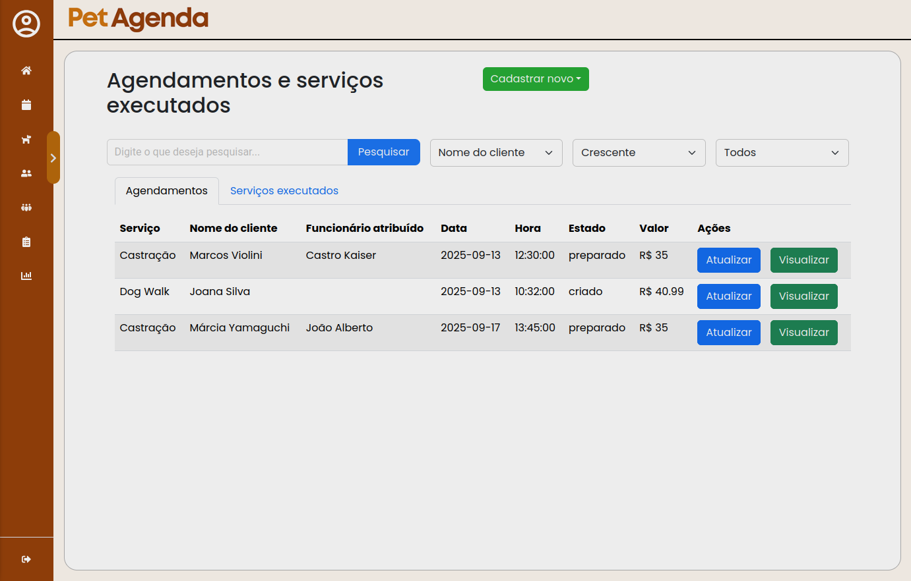
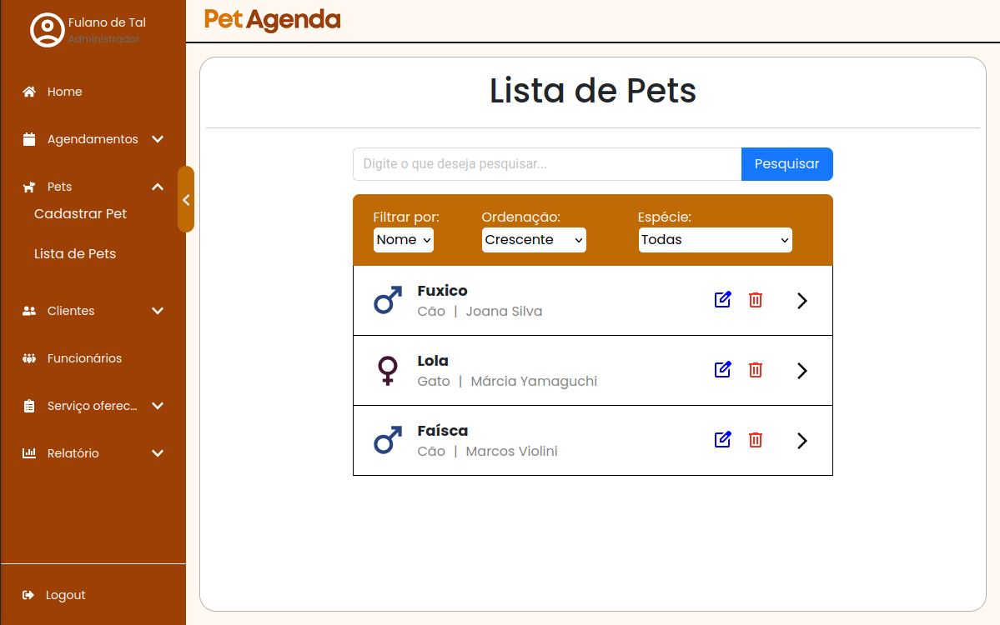
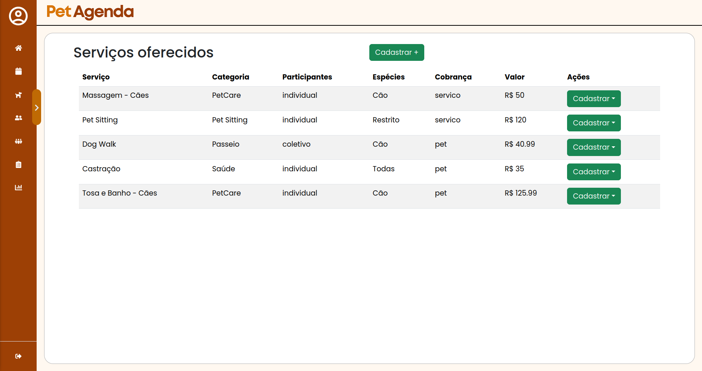
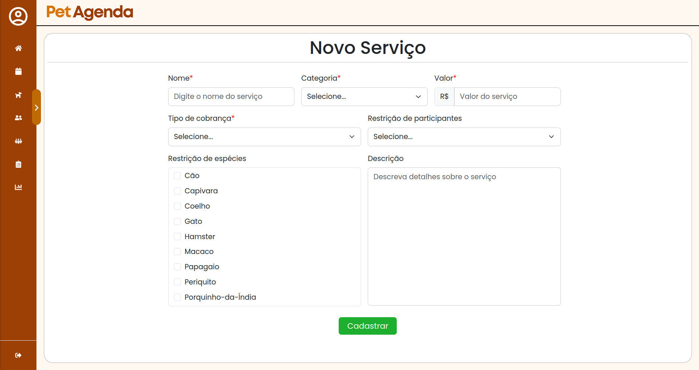

<h1 style="text-align: center">🐾PetAgenda🐾</h1>



O PetAgenda é uma plataforma digital para agendamento e gestão no setor Petcare, voltada a profissionais autônomos e empresas. Ela oferece recursos como cadastro de clientes, agendamentos, controle de funcionários e relatórios, ajudando a organizar o trabalho e facilitar decisões, diante da falta de ferramentas específicas na área.

# 📄Descrição
O PetAgenda é um projeto de TCC desenvolvido após um ano e meio de estudos no SENAI de Vitória–ES, no curso de Desenvolvimento de Sistemas. A plataforma surgiu da análise do crescimento do mercado pet e da falta de ferramentas específicas para serviços como Dog Walking e Pet Sitting, sendo uma oportunidade para aplicar todas as habilidades adquiridas ao longo do curso.

# 🛠Tecnologias utilizadas
<p align="center">
  <!-- Frontend -->
  
  
  
  
  

  <!-- Backend e Banco -->
  
  

  <!-- Design e DevOps -->
  
  
  

  <!-- Ferramentas -->
  
  
 


</p>


# 📝 Passo a passo para inicializar o projeto

### 1. Instalar o Docker Engine e o Docker Compose

No Windows e macOS é recomendável usar o Docker Desktop.

Links do Docker Desktop:
- [Windows](https://docs.docker.com/desktop/setup/install/windows-install/)
- [macOS](https://docs.docker.com/desktop/setup/install/mac-install)
- [Distribuições Linux](https://docs.docker.com/desktop/setup/install/linux/)

### 2. Clonar o repositório

> Para clonar o repositório é necessário ter o [git](https://git-scm.com/) instalado.

Com o git instalado, abra um terminal (no Windows é o 'cmd' ou PowerShell) e digite:

```
git clone https://github.com/tbaiense/petagenda-web.git petagenda
```

depois:

```
cd petagenda
```

### 3. Gerenciando os serviços usando o docker compose

Para colocar os serviços em execução:

```
docker compose -f docker-compose.yaml up -d
```

Parando todos os serviços e removendo dados gerados:

```
docker compose -f docker-compose.yaml down --rmi local --volumes
```

### 4. Acessando 

No navegador de internet, acesse o link: http://localhost:8080/

# Imagens e demonstração

## Listagem de agendamentos


## Listagem de pets


## Listagem de serviços oferecidos


## Cadastro de serviço oferecido


# </> Desenvolvedores
<table> 
  <tr> 
    <td align="center" width="200">
      <a href="https://github.com/tbaiense"> 
         
        <br /> 
        <sub>
          <b>
            Thiago Baiense
          </b>
        </sub>
        <br /> 
        <em>
          Deselvolvedor
        </em>
        <br /> 
        <a href="https://github.com/tbaiense"> 
           
        </a> 
      </a> 
    </td>
    <td align="center" width="200">
      <a href="https://github.com/Arescoderx"> 
         
        <br /> 
        <sub>
          <b>
            Matheus Schmidt
          </b>
        </sub>
        <br /> 
        <em>
          Desenvolvedor
        </em>
        <br /> 
        <a href="https://github.com/Arescoderx"> 
           
        </a> 
      </a> 
    </td> 
    <td align="center" width="200">
      <a href="https://github.com/CastroKaiser"> 
         
        <br /> 
        <sub>
          <b>
            Castro Kaiser
          </b>
        </sub>
        <br /> 
        <em>
          Desenvolvedor
        </em>
        <br /> 
        <a href="https://github.com/CastroKaiser"> 
           
        </a> 
      </a> 
    </td> 
    <td align="center" width="200">
      <a href="https://github.com/Koji-Kashin"> 
         
        <br /> 
        <sub>
          <b>
            Daniel Rodrigues
          </b>
        </sub>
        <br /> 
        <em>
          Desenvolvedor
        </em>
        <br /> 
        <a href="https://github.com/Koji-Kashin"> 
           
        </a> 
      </a> 
    </td> 
  </tr> 
</table>
